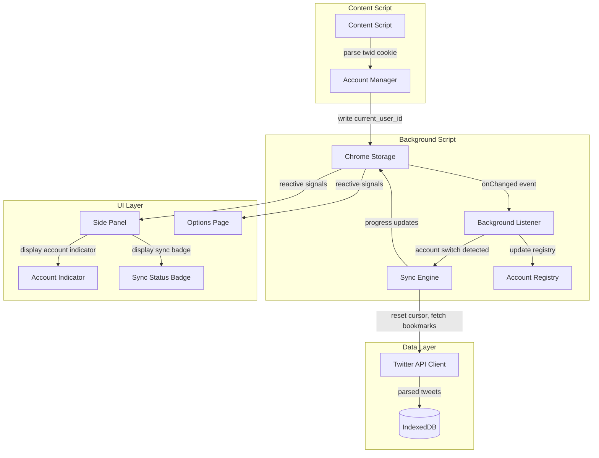
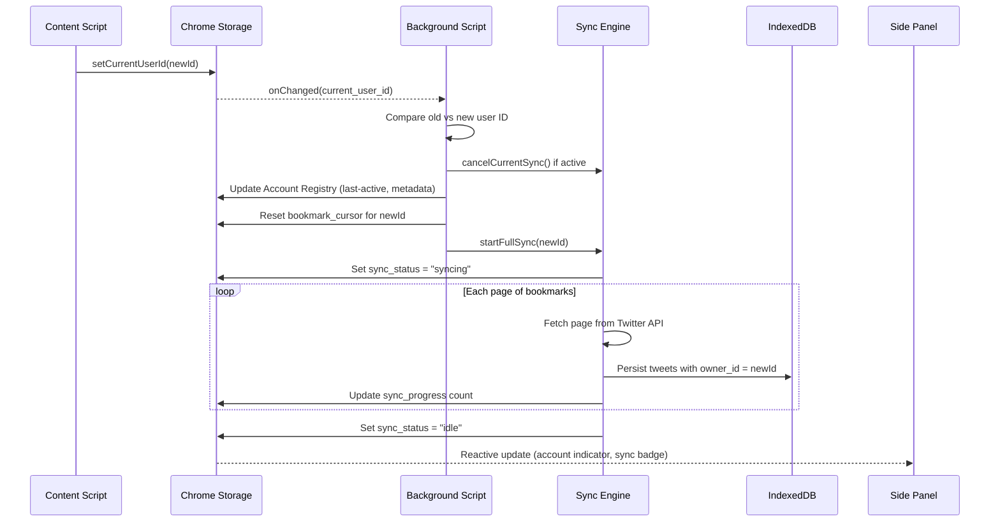

# Design Document: Multi-Account Support

## Overview

This design adds multi-account support to the Twillot Chrome extension suite so that each X/Twitter account has its own isolated data context. The system detects the active account from the browser's `twid` cookie, maintains a registry of known accounts, partitions all data (IndexedDB records and Chrome Storage entries) by owner ID, and triggers a full bookmark sync on account switch.

The existing codebase already uses `owner_id` as a partition key in IndexedDB and namespaces Chrome Storage keys with `user:{user_id}:`. This design formalizes those patterns, adds an Account Registry, introduces an Account Manager module, and wires up the UI to reflect the active account.

### Design Decisions

1. **Single IndexedDB database, partitioned by `owner_id`** — Rather than creating a separate database per account, we keep the existing single `twillot` database and rely on the `owner_id` index for isolation. This avoids schema duplication and simplifies migrations.

2. **Account Registry in Chrome Storage** — The registry is lightweight metadata (max 20 entries) and needs to be accessible from all extension contexts without opening IndexedDB. Chrome Storage local area is the right fit.

3. **Content script as the single source of truth for account detection** — The `twid` cookie is only accessible from content scripts running on `x.com`. The content script writes the detected user ID to Chrome Storage, and all other contexts react to that change.

4. **Full sync on every account switch** — Resetting the cursor ensures data completeness. Since bookmarks can be added/removed while the user is on another account, incremental sync from a stale cursor would miss deletions.

## Architecture



### Data Flow on Account Switch



## Components and Interfaces

### 1. Account Manager (`packages/utils/account-manager.ts`)

Central module for account detection, registry management, and switch coordination.

```typescript
export interface AccountEntry {
  user_id: string
  screen_name: string
  profile_image_url: string
  first_seen_at: number    // Unix timestamp (seconds)
  last_active_at: number   // Unix timestamp (seconds)
}

export interface AccountManager {
  /** Detect active account from twid cookie and update Chrome Storage */
  detectAndSetActiveAccount(): Promise<void>

  /** Get the current active account user ID */
  getActiveAccountId(): Promise<string>

  /** Get all registered accounts sorted by last_active_at desc */
  getAccountRegistry(): Promise<AccountEntry[]>

  /** Add or update an account in the registry */
  upsertAccountEntry(entry: Partial<AccountEntry> & { user_id: string }): Promise<void>

  /** Remove an account from the registry (not the active account) */
  removeAccount(userId: string): Promise<void>

  /** Check if an account switch occurred and return the new user ID, or null */
  checkForAccountSwitch(previousUserId: string): Promise<string | null>
}
```

### 2. Data Context Guard (`packages/utils/db/context-guard.ts`)

Enforces data isolation by validating owner_id on all operations.

```typescript
export interface ContextGuard {
  /** Get the current owner_id, throws if empty */
  requireActiveAccount(): Promise<string>

  /** Validate that a record's owner_id matches the active account */
  validateOwnership(recordOwnerId: string): Promise<void>

  /** Wrap a DB operation with ownership validation */
  withOwnershipCheck<T>(operation: () => Promise<T>): Promise<T>
}
```

### 3. Sync Engine Extensions (`packages/utils/sync-engine.ts`)

Extends the existing sync logic with account-switch awareness.

```typescript
export interface SyncState {
  status: 'idle' | 'syncing' | 'error'
  progress: number          // Number of bookmarks synced so far
  total: number | null      // Total if known, null otherwise
  owner_id: string          // Account being synced
  error_message?: string
}

export interface SyncEngine {
  /** Start a full sync for the given account (resets cursor) */
  startFullSync(userId: string): Promise<void>

  /** Cancel the current sync, persisting cursor position */
  cancelCurrentSync(): Promise<void>

  /** Resume sync from last saved cursor */
  resumeSync(userId: string): Promise<void>

  /** Get current sync state */
  getSyncState(): Promise<SyncState>
}
```

### 4. Account Indicator Component (`x-bookmarks/src/components/AccountIndicator.tsx`)

SolidJS component displaying the active account in the sidebar.

```typescript
interface AccountIndicatorProps {
  userId: string
  screenName: string
  profileImageUrl: string
  syncStatus: 'idle' | 'syncing' | 'error'
  syncProgress?: number
}
```

### 5. Account Cleanup Service (`packages/utils/account-cleanup.ts`)

Handles deletion of account data across both storage layers.

```typescript
export interface AccountCleanupResult {
  indexedDbDeleted: boolean
  chromeStorageDeleted: boolean
  registryRemoved: boolean
}

export interface AccountCleanupService {
  /** Delete all data for a non-active account */
  deleteAccountData(userId: string): Promise<AccountCleanupResult>

  /** Validate that the target account is not the active account */
  canDelete(userId: string): Promise<boolean>
}
```

## Data Models

### Account Registry (Chrome Storage)

Stored under key `account_registry` in Chrome Storage local area.

```typescript
// Chrome Storage key: "account_registry"
type AccountRegistry = AccountEntry[]  // Max 20 entries

interface AccountEntry {
  user_id: string                // Numeric X/Twitter user ID
  screen_name: string            // @handle (may be empty initially)
  profile_image_url: string      // Avatar URL (may be empty initially)
  first_seen_at: number          // Unix timestamp (seconds)
  last_active_at: number         // Unix timestamp (seconds)
}
```

### Sync State (Chrome Storage, per-account)

```typescript
// Chrome Storage key: "user:{user_id}:sync_state"
interface PersistedSyncState {
  status: 'idle' | 'syncing' | 'error'
  progress: number
  last_synced_at: number         // Unix timestamp (seconds)
  error_message?: string
}
```

### Existing IndexedDB Schema (unchanged)

The existing schema already supports multi-account via `owner_id`:

| Store | Key | owner_id indexed | Notes |
|-------|-----|-----------------|-------|
| `posts` | `id` (`{owner_id}_{tweet_id}`) | Yes | Bookmarks/tweets |
| `settings` | `id` (`{owner_id}_{option_name}`) | No (key contains owner) | Per-account config |
| `users` | `id` (`{owner_id}_{relationship}_{rest_id}`) | Yes | Followers/following |
| `folders` | `id` (`{owner_id}_{scope}_{name}`) | Yes (via `owner_id`) | Bookmark/user folders |

No schema changes are needed. The `owner_id` field and composite keys already partition data correctly.

### Chrome Storage Key Namespace (existing pattern, formalized)

| Key Pattern | Scope | Example |
|-------------|-------|---------|
| `current_user_id` | Global | `"123456789"` |
| `account_registry` | Global | `[{user_id: "123", ...}]` |
| `graphql_query_ids` | Global | `{Bookmarks: "abc123"}` |
| `user:{uid}:token` | Per-account | Auth bearer token |
| `user:{uid}:csrf` | Per-account | CSRF token |
| `user:{uid}:bookmark_cursor` | Per-account | Pagination cursor |
| `user:{uid}:lastForceSynced_v2` | Per-account | Last sync timestamp |
| `user:{uid}:sync_state` | Per-account | Sync progress state |
| `user:{uid}:tasks` | Per-account | Automation tasks |


## Correctness Properties

*A property is a characteristic or behavior that should hold true across all valid executions of a system — essentially, a formal statement about what the system should do. Properties serve as the bridge between human-readable specifications and machine-verifiable correctness guarantees.*

### Property 1: Cookie Parsing Round-Trip

*For any* valid numeric string `id`, encoding it as `u%3D{id}` and parsing it with the cookie extractor SHALL produce the original `id`. *For any* string that does not contain a valid numeric value after removing the `u%3D` prefix (including empty strings, non-numeric characters, and absent cookies), the parser SHALL return an empty string.

**Validates: Requirements 1.1, 1.3**

### Property 2: Storage Key Namespacing

*For any* non-empty user ID and any storage key name (excluding `current_user_id`), the `getStorageKey` function SHALL produce a string matching the format `user:{user_id}:{key}`. *For any* empty user ID, the function SHALL return the key unchanged.

**Validates: Requirements 1.5, 3.2**

### Property 3: Registry Upsert Correctness

*For any* Account Registry state and any account entry to upsert: if the entry's `user_id` does not exist in the registry, the entry SHALL be added with all provided fields and the registry size SHALL increase by one. If the entry's `user_id` already exists, the `screen_name`, `profile_image_url`, and `last_active_at` fields SHALL be updated to the new values while `first_seen_at` SHALL remain unchanged.

**Validates: Requirements 2.1, 2.5**

### Property 4: Registry Invariants (Sorted and Bounded)

*For any* sequence of upsert operations on an Account Registry, the resulting registry SHALL always be sorted by `last_active_at` in descending order AND SHALL never contain more than 20 entries. When an insertion would exceed 20 entries, the entry with the smallest `last_active_at` value SHALL be evicted.

**Validates: Requirements 2.3, 2.4**

### Property 5: Data Isolation on Query

*For any* set of IndexedDB records with varying `owner_id` values, querying records as a specific owner SHALL return only records where `owner_id` matches that owner. No record belonging to a different owner SHALL ever appear in the results.

**Validates: Requirements 3.1**

### Property 6: Empty Owner Rejects Operations

*For any* read or write operation attempted when the Active_Account owner ID is null, undefined, or an empty string, the Data_Context SHALL reject the operation with an error. No data SHALL be read or written.

**Validates: Requirements 3.4**

### Property 7: Ownership Mismatch Rejects Writes

*For any* pair of distinct user IDs (active account A and record owner B where A ≠ B), attempting to write a record with `owner_id = B` while the active account is A SHALL be rejected with an ownership mismatch error.

**Validates: Requirements 3.5**

### Property 8: Sync Resume from Last Cursor

*For any* sync sequence interrupted at page N (where N > 0), the persisted cursor SHALL equal the cursor returned after page N-1 was fetched. When sync resumes, it SHALL start fetching from that persisted cursor position, not from the beginning.

**Validates: Requirements 4.4**

### Property 9: Account Switch Preserves Previous Data

*For any* set of records (IndexedDB and Chrome Storage) belonging to account A, after switching the active account to B (where A ≠ B), all of A's records SHALL remain unchanged in count and content. No record SHALL be deleted, modified, or overwritten.

**Validates: Requirements 5.1, 5.2**

### Property 10: Account Deletion Completeness

*For any* non-active account with records in IndexedDB and Chrome Storage, after successful deletion, there SHALL be zero IndexedDB records where `owner_id` matches the deleted account AND zero Chrome Storage keys matching the `user:{deleted_id}:*` namespace AND the account SHALL not appear in the Account Registry.

**Validates: Requirements 7.2, 7.3, 7.4**

### Property 11: Active Account Cannot Be Deleted

*For any* active account (the account whose user ID matches `current_user_id` in Chrome Storage), attempting to delete that account SHALL be rejected, and all data (IndexedDB records, Chrome Storage entries, and registry entry) SHALL remain unchanged.

**Validates: Requirements 7.5**

## Error Handling

### Account Detection Errors

| Scenario | Behavior |
|----------|----------|
| `twid` cookie absent | Set active account to empty string; disable sync/API operations |
| `twid` cookie malformed (non-numeric after prefix removal) | Set active account to empty string; log warning |
| Chrome Storage write fails during account detection | Retry once; if still failing, log error and leave previous state |

### Data Isolation Errors

| Scenario | Behavior |
|----------|----------|
| Operation attempted with empty owner_id | Throw `NoActiveAccountError` with message "No active account detected" |
| Write targets record with mismatched owner_id | Throw `OwnershipMismatchError` with message "Cannot write to another account's data" |
| IndexedDB open fails | Reject with descriptive error; UI shows "Database unavailable" message |

### Sync Engine Errors

| Scenario | Behavior |
|----------|----------|
| Network error during sync | Persist current cursor; set sync state to `error`; allow manual retry |
| API rate limit (429) | Persist cursor; set sync state to `error` with rate limit message; auto-retry after backoff |
| API auth error (401/403) | Persist cursor; set sync state to `error`; prompt user to re-authenticate on X/Twitter |
| Account switch during sync | Cancel current sync; persist cursor for previous account; start new sync |

### Account Cleanup Errors

| Scenario | Behavior |
|----------|----------|
| Attempt to delete active account | Reject immediately with `ActiveAccountDeletionError` |
| IndexedDB deletion succeeds, Chrome Storage fails | Report partial failure; keep account in registry; show error to user |
| Chrome Storage deletion succeeds, IndexedDB fails | Report partial failure; keep account in registry; show error to user |
| Both deletions succeed | Remove from registry; show success confirmation |

## Testing Strategy

### Property-Based Tests (Vitest + fast-check)

Property-based testing is appropriate for this feature because the core logic involves pure functions (cookie parsing, key namespacing, registry management) and data invariants (isolation, bounds, preservation) that should hold across a wide range of inputs.

**Library**: `fast-check` with Vitest
**Minimum iterations**: 100 per property
**Tag format**: `Feature: multi-account-support, Property {N}: {title}`

Properties to implement:
1. Cookie parsing round-trip and validation
2. Storage key namespacing format
3. Registry upsert correctness (new vs existing)
4. Registry invariants (sorted + bounded at 20)
5. Data isolation on query (owner_id filtering)
6. Empty owner rejects operations
7. Ownership mismatch rejects writes
8. Sync resume from last cursor
9. Account switch preserves previous data
10. Account deletion completeness
11. Active account cannot be deleted

### Unit Tests (Vitest + fake-indexeddb)

- Account detection from various cookie formats (valid, malformed, absent)
- Registry CRUD operations (add, update, evict, remove)
- Sync state transitions (idle → syncing → idle/error)
- Sync cancellation and cursor persistence
- Account indicator component rendering states
- Confirmation dialog for account deletion
- Partial failure handling in cleanup service

### Integration Tests

- Full account switch flow: detect → update storage → cancel old sync → start new sync
- Data queryability after switch-back (existing data immediately available)
- Background script reacting to `chrome.storage.onChanged` events
- Sync progress updates flowing to UI components

### Test Infrastructure

- `fake-indexeddb` for IndexedDB mocking (already in project)
- Chrome Storage mock (already in `__mocks__/webextension-polyfill.ts`)
- Custom generators for `AccountEntry`, `Tweet` (with varying `owner_id`), and cookie strings
