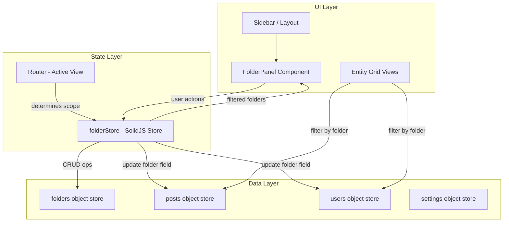

# Design Document: Universal Folders

## Overview

This design transforms the folder system from a flat string-array config (`OptionName.FOLDER`) into a first-class IndexedDB object store with entity-scoped folder records. Each folder belongs to exactly one scope (`bookmark` or `user`), enabling independent folder sets per entity type. The sidebar is restructured so the Folder Panel sits at the bottom, and its contents dynamically reflect the active view's entity scope.

### Key Design Decisions

1. **New `folders` object store in IndexedDB** — Folders become their own records rather than a serialized array inside the settings store. This enables indexed queries by scope and sort order.
2. **Migration via `onupgradeneeded`** — The DB version is incremented, and migration logic runs exactly once inside the upgrade transaction. On failure the transaction aborts, preserving existing data.
3. **Folder reference remains a string field on entities** — Both `posts.folder` and `users.folder` continue to store the folder name as a string. This avoids a costly re-keying migration and keeps filtering via existing indexes intact.
4. **Context-aware panel driven by route** — The current route (`/` = bookmarks, `/users` = users) determines which `EntityScope` the Folder Panel queries.

## Architecture



### Data Flow

1. On app init, the `folderStore` reads folders from IndexedDB filtered by the active scope.
2. CRUD operations mutate both the IndexedDB `folders` store and the in-memory SolidJS store.
3. Assigning entities to folders updates the `folder` string field on the relevant entity records.
4. The Folder Panel subscribes to the SolidJS store and re-renders on changes.
5. Filtering is performed by passing the selected folder name to the existing query functions (`findRecords`, `findUsers`).

## Components and Interfaces

### New / Modified Components

| Component | Location | Responsibility |
|-----------|----------|----------------|
| `FolderPanel` | `x-bookmarks/src/components/FolderPanel.tsx` | Replaces `AsideFolder.tsx`. Renders scope-filtered folder list, unsorted count, drag-and-drop reorder, inline create/rename. |
| `Layout` (modified) | `x-bookmarks/src/options/Layout.tsx` | Moves Folder Panel to bottom of sidebar with sticky positioning. Hides panel on non-entity pages. |
| `MoveToFolderDialog` (modified) | `x-bookmarks/src/options/grid/MoveToFolderDialog.tsx` | Filters folder list by current entity scope. |
| `folderStore` | `x-bookmarks/src/stores/folders.ts` | Rewritten to use the new `folders` object store. Exposes CRUD + assignment functions scoped by `EntityScope`. |

### New Shared Utilities

| Module | Location | Responsibility |
|--------|----------|----------------|
| `db/folders.ts` | `packages/utils/db/folders.ts` | IndexedDB CRUD for the `folders` object store. |
| `db/index.ts` (modified) | `packages/utils/db/index.ts` | DB version bump, new store creation, migration logic. |
| `types/folder.ts` | `packages/utils/types/folder.ts` | `Folder` interface, `EntityScope` type. |

### Key Interfaces

```typescript
// packages/utils/types/folder.ts

export type EntityScope = 'bookmark' | 'user'

export interface Folder {
  /** Composite key: `${owner_id}_${scope}_${name}` */
  id: string
  owner_id: string
  name: string
  scope: EntityScope
  sort_order: number
  created_at: number
}
```

```typescript
// packages/utils/db/folders.ts — public API

export function getFolderId(ownerId: string, scope: EntityScope, name: string): string

export async function createFolder(name: string, scope: EntityScope): Promise<Folder>
export async function renameFolder(oldName: string, newName: string, scope: EntityScope): Promise<void>
export async function deleteFolder(name: string, scope: EntityScope): Promise<void>
export async function reorderFolders(orderedNames: string[], scope: EntityScope): Promise<void>
export async function getFoldersByScope(scope: EntityScope): Promise<Folder[]>
export async function folderExists(name: string, scope: EntityScope): Promise<boolean>
```

```typescript
// Updated store shape (x-bookmarks/src/stores/folders.ts)

interface FolderStoreState {
  folders: Folder[]
  activeScope: EntityScope
  activeFolder: string | null  // null = no filter, 'Unsorted' = unassigned
}
```

## Data Models

### IndexedDB Schema Changes

**New object store: `folders`**

| Field | Type | Key/Index | Description |
|-------|------|-----------|-------------|
| `id` | string | Primary key | `${owner_id}_${scope}_${name}` |
| `owner_id` | string | Index | Current user ID |
| `name` | string | — | Folder display name (1–50 chars) |
| `scope` | string | Index | `'bookmark'` or `'user'` |
| `sort_order` | number | Index | 0-based position within scope |
| `created_at` | number | — | Unix timestamp |

**Compound index:** `[owner_id, scope]` for efficient scope-filtered queries.

**Existing stores (unchanged schema):**

- `posts` — retains `folder?: string` field and existing `folder` index
- `users` — retains `folder?: string` field (add index if missing)

### Migration Strategy (DB_VERSION 21 → 22)

The migration runs inside `onupgradeneeded`:

1. Create the `folders` object store with indexes.
2. Add `folder` index to `users` store if not present.
3. Read all records from `settings` store, find the `OptionName.FOLDER` config for the current user.
4. For each folder name in the legacy array, create a `Folder` record with `scope: 'bookmark'` and `sort_order` matching array index.
5. Scan `users` store for distinct non-empty `folder` values. For each, create a `Folder` record with `scope: 'user'`.
6. If any write fails, the transaction aborts automatically (IndexedDB behavior), preserving existing data at version 21.

### Validation Rules

| Rule | Constraint |
|------|-----------|
| Name length | 1 ≤ trimmed length ≤ 50 |
| Name uniqueness | Unique per `(owner_id, scope)` |
| Whitespace-only | Rejected after trim |
| Scope values | `'bookmark'` or `'user'` only |


## Correctness Properties

*A property is a characteristic or behavior that should hold true across all valid executions of a system — essentially, a formal statement about what the system should do. Properties serve as the bridge between human-readable specifications and machine-verifiable correctness guarantees.*

### Property 1: Folder structural integrity

*For any* valid folder name (1–50 non-whitespace-only characters) and valid entity scope, creating a folder and reading it back SHALL yield a record with the trimmed name, the specified scope, and a non-negative integer sort order.

**Validates: Requirements 1.1, 1.2**

### Property 2: Uniqueness within scope

*For any* folder name and entity scope, creating a folder that already exists in that scope SHALL be rejected, while creating the same name in a different scope SHALL succeed.

**Validates: Requirements 1.3, 1.4**

### Property 3: Scope-filtered query correctness

*For any* set of folders distributed across both scopes, querying by a given scope SHALL return only folders matching that scope, ordered by sort_order ascending with no gaps or duplicates.

**Validates: Requirements 1.5**

### Property 4: Migration maps legacy folders to bookmark scope

*For any* non-empty legacy folder name array, migration SHALL produce exactly one folder record per name with scope `bookmark` and sort_order equal to the original array index.

**Validates: Requirements 1.6, 7.1**

### Property 5: Whitespace trimming on create

*For any* string with leading or trailing whitespace whose trimmed length is 1–50, creating a folder SHALL store the trimmed name and append it at the end of the sort order for that scope.

**Validates: Requirements 2.1**

### Property 6: Delete cascade clears entity references

*For any* folder with one or more entities assigned to it, deleting that folder SHALL remove the folder record and set the folder field to empty on every entity that was assigned to it within the same scope.

**Validates: Requirements 2.2**

### Property 7: Reorder persists permutation

*For any* permutation of folder names within a scope, calling reorder with that permutation SHALL result in each folder's sort_order matching its new position index.

**Validates: Requirements 2.3**

### Property 8: Invalid names are rejected

*For any* folder name that is empty after trimming, exceeds 50 characters after trimming, or duplicates an existing name in the same scope, the create or rename operation SHALL be rejected and the store state SHALL remain unchanged.

**Validates: Requirements 2.4**

### Property 9: Delete isolation across scopes

*For any* folder deleted in one scope, all folders and entity-to-folder assignments in the other scope SHALL remain unchanged.

**Validates: Requirements 2.5**

### Property 10: Rename cascade updates entity references

*For any* folder with assigned entities, renaming that folder SHALL update the folder record's name and update the folder field on all assigned entities within the same scope to the new name.

**Validates: Requirements 2.6**

### Property 11: Entity assignment replaces previous folder

*For any* set of entities (bookmarks or users) moved to a target folder, each entity's folder field SHALL equal the target folder name after the operation, regardless of its previous folder value.

**Validates: Requirements 3.1, 3.2, 3.3**

### Property 12: Non-existent folder assignment rejected

*For any* folder name that does not exist in the store for the given scope, attempting to move entities to that folder SHALL be rejected without modifying any entity records.

**Validates: Requirements 3.6**

### Property 13: Context-aware folder display

*For any* active view with an associated entity scope, the Folder Panel SHALL display exactly the folders matching that scope in persisted sort order, and no folders from the other scope.

**Validates: Requirements 5.1, 5.2**

### Property 14: Unsorted count correctness

*For any* set of entities in a given scope, the "Unsorted" count SHALL equal the number of entities whose folder field is empty or null.

**Validates: Requirements 5.4**

### Property 15: Folder filter correctness

*For any* folder filter selection (including "Unsorted"), the displayed entities SHALL be exactly those whose folder field matches the selection (empty/null for "Unsorted", folder name otherwise).

**Validates: Requirements 6.1, 6.2**

### Property 16: Migration preserves post folder fields

*For any* set of post records with existing folder field values, after migration completes, every post record's folder field SHALL remain identical to its pre-migration value.

**Validates: Requirements 7.2**

### Property 17: Migration creates user-scoped folders from user records

*For any* set of user records with non-empty folder values, migration SHALL create exactly one folder record with scope `user` for each distinct folder value found, with no duplicates.

**Validates: Requirements 7.3**

## Error Handling

| Scenario | Behavior | User Feedback |
|----------|----------|---------------|
| Duplicate folder name in same scope | Reject operation, return error | Toast: "A folder with this name already exists" |
| Empty or whitespace-only name | Reject operation | Inline validation: "Folder name cannot be empty" |
| Name exceeds 50 characters | Reject operation | Inline validation: "Folder name must be 50 characters or fewer" |
| Move to non-existent folder | Reject operation | Toast: "Target folder no longer exists" |
| Partial bulk move failure | Complete remaining, report counts | Toast: "Moved X items. Y items failed to update." |
| Migration failure | Abort transaction, preserve data at prior version | Console error log; user sees old folder system until next upgrade attempt |
| IndexedDB unavailable | Graceful degradation | Alert: "Storage unavailable. Folders cannot be loaded." |

### Error Propagation

- Data layer (`packages/utils/db/folders.ts`) throws typed errors (`DuplicateFolderError`, `InvalidFolderNameError`, `FolderNotFoundError`).
- Store layer (`x-bookmarks/src/stores/folders.ts`) catches errors and surfaces them via a reactive `error` signal.
- UI layer reads the error signal and displays appropriate toast/inline messages.

## Testing Strategy

### Property-Based Tests (Vitest + fast-check)

Property-based testing is appropriate for this feature because the folder CRUD operations are pure data transformations with clear input/output behavior, universal invariants, and a large input space (arbitrary strings, multiple scopes, varying entity counts).

**Library:** `fast-check` with Vitest
**Minimum iterations:** 100 per property
**Tag format:** `Feature: universal-folders, Property {N}: {title}`

Properties 1–12 and 14–17 will be implemented as property-based tests against the data layer using `fake-indexeddb` for in-memory IndexedDB simulation.

Property 13 and 15 will be tested at the store/component level with `@solidjs/testing-library` + `fake-indexeddb`.

### Unit Tests (Vitest)

- Folder name validation edge cases (exactly 50 chars, exactly 1 char, unicode, emoji)
- Migration with empty/null legacy config (Requirement 7.6)
- UI: Folder Panel visibility on non-entity pages (Requirement 5.5)
- UI: Toggle folder filter on/off (Requirement 6.4)
- UI: Navigation clears filter (Requirement 6.5)
- UI: Pagination resets on filter (Requirement 6.6)
- UI: Sidebar DOM order (Requirements 4.1, 4.2)
- UI: Default expanded state (Requirement 4.3)

### Integration Tests

- Migration error recovery with simulated write failure (Requirements 1.7, 7.4)
- Partial bulk move failure with simulated record errors (Requirement 3.5)
- Migration idempotency — DB opened twice at same version (Requirement 7.5)

### Test Environment

- `fake-indexeddb` for IndexedDB simulation in Node.js
- `@solidjs/testing-library` + `jsdom` for component tests
- Vitest workspace configuration in `packages/utils/` for data layer tests
- Vitest configuration in `x-bookmarks/` for UI/store tests
