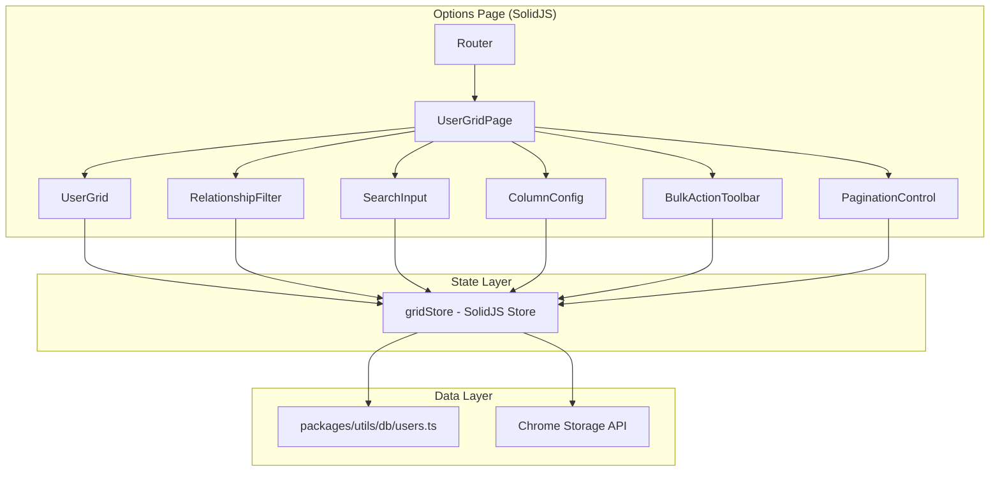

# Technical Design Document: User Grid View

## Overview

The User Grid View feature adds a paginated, sortable, and configurable table to the Twillot Exporter Chrome extension for browsing synced Twitter/X user data (followers and following). It builds on the existing IndexedDB `users` table and the `StoredUser` type in `packages/utils/db/users.ts`.

The feature introduces a new route/page within the exporter's options UI that renders a data grid with:
- Column visibility configuration persisted via Chrome Storage API
- Client-side pagination with configurable page size
- Tri-state column sorting (ascending → descending → none)
- Batch selection with bulk actions (Move to Folder, Unfollow)
- Relationship filter (Followers / Following)
- Debounced keyword search across name, screen_name, and description

### Design Decisions

1. **Client-side sorting and filtering**: Since IndexedDB cursor-based queries are already used for keyword search (see `findUsers`), sorting will be performed in-memory after fetching the filtered dataset. This avoids complex compound index requirements and keeps the IndexedDB schema unchanged.

2. **SolidJS reactive store for grid state**: A dedicated `createStore` manages grid state (page, sort, filters, selection, column visibility) — consistent with the existing `store.ts` pattern.

3. **Chrome Storage for column preferences**: Column visibility is a lightweight user preference that should persist across sessions. Chrome Storage API (local) is the established pattern for such settings.

4. **No new IndexedDB schema changes**: The existing `users` table with `owner_id`, `relationship`, and `screen_name` indexes is sufficient. The `findUsers` function already supports relationship filtering and keyword search.

## Architecture



### Data Flow

1. On mount, the page reads column preferences from Chrome Storage and user data from IndexedDB.
2. User interactions (filter change, search, sort, page navigation) update the reactive store.
3. Store changes trigger re-queries to IndexedDB (for filtering/search) or in-memory re-sorts.
4. Column visibility changes are persisted to Chrome Storage with debounced writes.
5. Bulk actions dispatch API calls (unfollow) or IndexedDB updates (folder assignment).

## Components and Interfaces

### Page Component: `UserGridPage`

**Location**: `exporter/src/options/UserGridPage.tsx`

The top-level page component that composes all sub-components and initializes the grid store.

```typescript
// Entry point — renders the full grid view
export default function UserGridPage(): JSX.Element
```

### Component: `RelationshipFilter`

**Location**: `exporter/src/options/grid/RelationshipFilter.tsx`

A segmented control (two buttons) to toggle between "Followers" and "Following".

```typescript
interface RelationshipFilterProps {
  value: 'follower' | 'following'
  onChange: (value: 'follower' | 'following') => void
}
```

### Component: `SearchInput`

**Location**: `exporter/src/options/grid/SearchInput.tsx`

A text input with 300ms debounce. Max 100 characters.

```typescript
interface SearchInputProps {
  value: string
  onSearch: (keyword: string) => void
}
```

### Component: `ColumnConfig`

**Location**: `exporter/src/options/grid/ColumnConfig.tsx`

A dropdown/popover with toggle switches for each column. Uses Kobalte's `Popover` primitive.

```typescript
interface ColumnConfigProps {
  columns: ColumnDef[]
  visibility: Record<string, boolean>
  onToggle: (columnKey: string) => void
}
```

### Component: `UserGrid`

**Location**: `exporter/src/options/grid/UserGrid.tsx`

The table component rendering headers (with sort indicators) and rows.

```typescript
interface UserGridProps {
  users: StoredUser[]
  columns: ColumnDef[]
  visibility: Record<string, boolean>
  sort: SortState | null
  selectedIds: Set<string>
  onSort: (columnKey: string) => void
  onSelectRow: (id: string) => void
  onSelectAll: () => void
}
```

### Component: `BulkActionToolbar`

**Location**: `exporter/src/options/grid/BulkActionToolbar.tsx`

Toolbar shown when rows are selected. Contains "Move to Folder" and "Unfollow" actions.

```typescript
interface BulkActionToolbarProps {
  selectedCount: number
  onMoveToFolder: () => void
  onUnfollow: () => void
}
```

### Component: `PaginationControl`

**Location**: `exporter/src/options/grid/PaginationControl.tsx`

Displays page info and navigation buttons. Supports page size selection.

```typescript
interface PaginationControlProps {
  currentPage: number
  totalPages: number
  pageSize: number
  onPageChange: (page: number) => void
  onPageSizeChange: (size: number) => void
}
```

### Grid Store

**Location**: `exporter/src/options/grid/gridStore.ts`

```typescript
import { createStore } from 'solid-js/store'

interface SortState {
  column: string
  direction: 'asc' | 'desc'
}

interface GridState {
  relationship: 'follower' | 'following'
  keyword: string
  page: number
  pageSize: number
  sort: SortState | null
  selectedIds: string[]
  columnVisibility: Record<string, boolean>
  users: StoredUser[]
  totalCount: number
  isLoading: boolean
  error: string | null
}
```

### Column Definition

```typescript
interface ColumnDef {
  key: string
  label: string
  sortable: boolean
  defaultVisible: boolean
}

const DEFAULT_COLUMNS: ColumnDef[] = [
  { key: 'avatar', label: 'Avatar', sortable: false, defaultVisible: true },
  { key: 'name', label: 'Name', sortable: true, defaultVisible: true },
  { key: 'screen_name', label: 'Username', sortable: true, defaultVisible: true },
  { key: 'followers_count', label: 'Followers', sortable: true, defaultVisible: true },
  { key: 'friends_count', label: 'Following', sortable: true, defaultVisible: true },
  { key: 'statuses_count', label: 'Posts', sortable: true, defaultVisible: true },
  { key: 'is_blue_verified', label: 'Verified', sortable: false, defaultVisible: true },
  { key: 'description', label: 'Bio', sortable: false, defaultVisible: true },
  { key: 'created_at', label: 'Joined', sortable: true, defaultVisible: true },
]
```

### Storage Key for Column Preferences

```typescript
const COLUMN_PREF_KEY = 'user_grid_column_visibility'
```

## Data Models

### StoredUser (existing — no changes)

From `packages/utils/db/users.ts`:

```typescript
interface StoredUser {
  id: string                    // Composite: `${owner_id}_${relationship}_${rest_id}`
  rest_id: string
  owner_id: string
  relationship: 'follower' | 'following'
  name: string
  screen_name: string
  profile_image_url_https: string
  profile_banner_url?: string
  description: string
  followers_count: number
  friends_count: number
  statuses_count: number
  is_blue_verified: boolean
  location: string
  created_at: string
  synced_at: number
}
```

### GridState (new)

```typescript
interface GridState {
  relationship: 'follower' | 'following'
  keyword: string
  page: number                          // 1-indexed
  pageSize: number                      // default: 20
  sort: SortState | null                // null = insertion order
  selectedIds: string[]                 // IDs of selected rows
  columnVisibility: Record<string, boolean>
  users: StoredUser[]                   // current page data
  totalCount: number                    // total matching users
  isLoading: boolean
  error: string | null
}

interface SortState {
  column: string
  direction: 'asc' | 'desc'
}
```

### Column Preference (Chrome Storage)

Stored under key `user_grid_column_visibility` as a JSON object:

```json
{
  "avatar": true,
  "name": true,
  "screen_name": true,
  "followers_count": true,
  "friends_count": false,
  "statuses_count": true,
  "is_blue_verified": true,
  "description": true,
  "created_at": true
}
```

## Correctness Properties

*A property is a characteristic or behavior that should hold true across all valid executions of a system — essentially, a formal statement about what the system should do. Properties serve as the bridge between human-readable specifications and machine-verifiable correctness guarantees.*

### Property 1: Relationship filter produces only matching records

*For any* list of StoredUser records with mixed `relationship` values and any selected relationship filter, the filtered output SHALL contain only users whose `relationship` field equals the selected filter value, and the count SHALL equal the number of matching records in the input.

**Validates: Requirements 1.1, 6.2**

### Property 2: Column toggle changes visibility correctly

*For any* valid column visibility state and any column key, toggling that column SHALL flip its visibility (visible → hidden, hidden → visible), provided the toggle does not violate the minimum-one-visible constraint.

**Validates: Requirements 2.2, 2.3**

### Property 3: Minimum one visible column invariant

*For any* column visibility state where exactly one column is visible, attempting to hide that column SHALL leave the visibility state unchanged (the column remains visible).

**Validates: Requirements 2.7**

### Property 4: Column preference round-trip

*For any* valid column visibility object (a Record<string, boolean> with at least one `true` value), persisting it to Chrome Storage and then loading it back SHALL produce an identical object.

**Validates: Requirements 2.4, 2.5**

### Property 5: Pagination math is correct

*For any* positive totalCount and positive pageSize, the computed totalPages SHALL equal `Math.ceil(totalCount / pageSize)`, and for any currentPage in [1, totalPages], the page is valid.

**Validates: Requirements 3.1**

### Property 6: Page navigation stays within valid bounds

*For any* grid state with totalPages >= 1, navigating forward from currentPage < totalPages SHALL increment the page by 1, navigating backward from currentPage > 1 SHALL decrement by 1, and navigation SHALL be disabled (no-op) at the boundaries (page 1 for previous, last page for next).

**Validates: Requirements 3.2, 3.3, 3.4, 3.5**

### Property 7: State changes reset pagination to page one

*For any* grid state where currentPage > 1, changing the relationship filter, applying a sort, changing the page size, or applying a search keyword SHALL reset currentPage to 1.

**Validates: Requirements 3.7, 4.6, 6.4, 7.3**

### Property 8: Sort produces correctly ordered output

*For any* list of StoredUser records and any sortable column, applying ascending sort SHALL produce a list where each consecutive pair satisfies `a[column] <= b[column]` (using numeric comparison for numeric columns, case-insensitive string comparison for text columns, and chronological comparison for date columns). Applying descending sort SHALL reverse this ordering.

**Validates: Requirements 4.1, 4.2, 4.7**

### Property 9: Non-sortable columns do not change sort state

*For any* current sort state (including null) and any non-sortable column key (avatar, is_blue_verified, description), clicking that column header SHALL produce the same sort state as before.

**Validates: Requirements 4.8**

### Property 10: Toolbar visibility and count reflect selection state

*For any* set of selected row IDs, the bulk action toolbar SHALL be visible if and only if the set is non-empty, and the displayed count SHALL equal the size of the selected set.

**Validates: Requirements 5.3, 5.6, 5.7**

### Property 11: Header checkbox state matches selection

*For any* page of N user rows and any subset S of selected IDs from that page, the header checkbox SHALL be: checked if |S| = N, unchecked if |S| = 0, and indeterminate if 0 < |S| < N.

**Validates: Requirements 5.2**

### Property 12: Navigation and filter changes clear selection

*For any* grid state with non-empty selectedIds, changing the page or changing the relationship filter SHALL result in an empty selectedIds set.

**Validates: Requirements 5.8, 6.6**

### Property 13: Search results all contain keyword

*For any* list of StoredUser records and any non-whitespace keyword string (up to 100 characters), every user in the filtered results SHALL have the keyword as a case-insensitive substring in at least one of: name, screen_name, or description.

**Validates: Requirements 7.1**

### Property 14: Whitespace-only search equals no search

*For any* string composed entirely of whitespace characters, applying it as a search keyword SHALL produce the same result set as having no search keyword applied (i.e., all users matching the current relationship filter).

**Validates: Requirements 7.2**

### Property 15: Keyword truncation to 100 characters

*For any* input string of length > 100, the effective search keyword used for filtering SHALL be the first 100 characters of that string.

**Validates: Requirements 7.5**

### Property 16: Partial bulk action failure preserves failed selections

*For any* set of selected user IDs where a bulk action succeeds for a subset and fails for the remainder, after the action completes the selectedIds SHALL contain exactly the IDs that failed.

**Validates: Requirements 5.10**

## Error Handling

| Scenario | Behavior |
|----------|----------|
| IndexedDB fails to open or query | Display error message in grid area; do not render partial/stale rows. Log error to console. |
| Chrome Storage read fails on load | Fall back to all-columns-visible default. Log warning. |
| Chrome Storage write fails | Show toast notification indicating preferences could not be saved. Retry on next change. |
| Unfollow API call fails (network) | Show error toast with count of failed operations. Preserve selection of failed rows. |
| Unfollow API rate-limited (429) | Show warning toast with estimated retry time. Preserve selection. |
| Move to Folder — IndexedDB write fails | Show error toast. Preserve selection of failed rows. |
| Search keyword exceeds 100 chars | Silently truncate to 100 characters. No error shown. |

## Testing Strategy

### Property-Based Tests (Vitest + fast-check)

The project uses Vitest. We will use `fast-check` as the property-based testing library since it integrates well with Vitest and supports TypeScript.

**Configuration:**
- Minimum 100 iterations per property test
- Each test tagged with: `Feature: user-grid-view, Property {number}: {title}`
- Tests target pure logic functions extracted from components

**Test targets (pure functions to extract):**
- `filterByRelationship(users: StoredUser[], relationship: string): StoredUser[]`
- `applyColumnToggle(visibility: Record<string, boolean>, key: string): Record<string, boolean>`
- `computeTotalPages(totalCount: number, pageSize: number): number`
- `navigatePage(current: number, total: number, direction: 'next' | 'prev'): number`
- `sortUsers(users: StoredUser[], sort: SortState | null): StoredUser[]`
- `filterByKeyword(users: StoredUser[], keyword: string): StoredUser[]`
- `truncateKeyword(input: string): string`
- `getHeaderCheckboxState(pageIds: string[], selectedIds: string[]): 'checked' | 'unchecked' | 'indeterminate'`
- `computeResetPage(stateChanged: boolean, currentPage: number): number`

### Unit Tests (Vitest)

Example-based tests for:
- Default column order matches specification (Req 1.2)
- No DM column exists (Req 1.3)
- Empty state rendering (Req 1.4, 6.5, 7.6)
- Default page size is 20 (Req 3.6)
- Default relationship filter is 'follower' (Req 6.3)
- Tri-state sort cycle (Req 4.3)
- Sort indicator direction (Req 4.4, 4.5)
- Debounce timing at 300ms (Req 7.4)
- Column preference persistence timing < 1s (Req 2.8)
- Pagination hidden when totalCount = 0 (Req 3.8)

### Integration Tests

- Bulk action notification shows correct success/failure counts (Req 5.9)
- IndexedDB error handling displays error message (Req 1.5)
- Chrome Storage round-trip for column preferences (Req 2.4, 2.5)

### Test File Location

```
exporter/src/options/grid/__tests__/
├── gridLogic.property.test.ts   # Property-based tests for pure logic
├── gridLogic.test.ts            # Unit tests for pure logic
├── UserGridPage.test.tsx        # Component integration tests
└── generators.ts                # fast-check arbitraries for StoredUser
```

